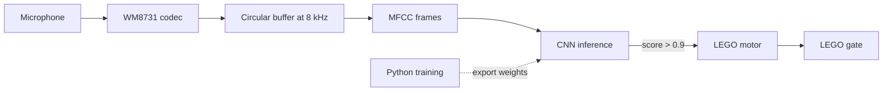

# Open Sesame

> Voice-activated LEGO gate. Say "open sesame" near the mic, an on-device CNN catches it, and a LEGO motor unlocks the door. Bare-metal RV32 C on a DE1-SoC, no cloud, no host PC.

[](https://en.wikipedia.org/wiki/C_(programming_language))
[](https://riscv.org)
[](https://www.terasic.com.tw/cgi-bin/page/archive.pl?Language=English&No=836)
[](https://www.python.org)


## ✨ Features
- **On-device keyword spotting.** Audio capture, MFCC extraction, and CNN inference all run on the DE1-SoC's RV32 soft-core. No cloud, no Wi-Fi, no host PC.
- **8 kHz real-time audio pipeline.** WM8731 codec brought up over I2C, samples streamed into a circular buffer in SDRAM.
- **MFCC + CNN, C from scratch.** Mel filter bank, DCT, and the inference engine are all hand-rolled. Model weights are exported from a Python/TensorFlow training script as a C array.
- **LEGO motor control.** Memory-mapped GPIO drives a LEGO Mindstorms motor that opens the gate when the model's confidence clears 0.9.
- **Tight memory map.** Weights and MFCC tables live in SDRAM. On-chip SRAM is reserved for the stack and small locals.

## 🏗 Architecture



The Python training pipeline lives in `training/`. After training, `export_weights.py` writes the network weights as a C array into `output/model_data.{c,h}`, which `inference.c` links against and runs on-device.

## 🛠 Stack
- C, bare-metal, no OS, no `malloc`
- RISC-V 32-bit (`rv32im_zicsr`, `ilp32`) on DE1-SoC's soft-core
- WM8731 audio codec via I2C, 8 kHz mono
- LEGO Mindstorms motor over memory-mapped GPIO
- Python + TensorFlow for training, weights exported to `output/model_data.{c,h}`
- Toolchain: FPGAcademy AMP RISC-V GCC, Intel Quartus Prime Lite

## 🚀 Build and run

You need a DE1-SoC, Quartus Prime Lite with the FPGAcademy AMP toolchain (the Makefile assumes the standard Windows install path), a mic wired to the WM8731, and a LEGO motor on the GPIO header.

```cmd
make COMPILE        :: build main.elf for RV32
make DE1-SoC        :: program the FPGA with the DE1-SoC Computer image
make GDB_SERVER     :: in one terminal
make GDB_CLIENT     :: in another, loads the elf and resets the core
```

To retrain the model:
```bash
cd training
pip install -r requirements.txt
python prepare_data.py        # build the dataset
python train_voice_gate.py    # train, write checkpoints
python export_weights.py      # emit ../output/model_data.c
```

Then rebuild with `make COMPILE`.

## 📸 Demo

Video of the gate opening: TBD.

## 👥 Team

Built for **ECE243 (Computer Organization)** at UofT:

- **Antoine Tabet** ([@tabetant](https://github.com/tabetant)) · [LinkedIn](https://linkedin.com/in/antoinetabetuoft) · [antoine.tabet@mail.utoronto.ca](mailto:antoine.tabet@mail.utoronto.ca)
- **Mohamad Salman** ([@mohamadmsalman82](https://github.com/mohamadmsalman82))
